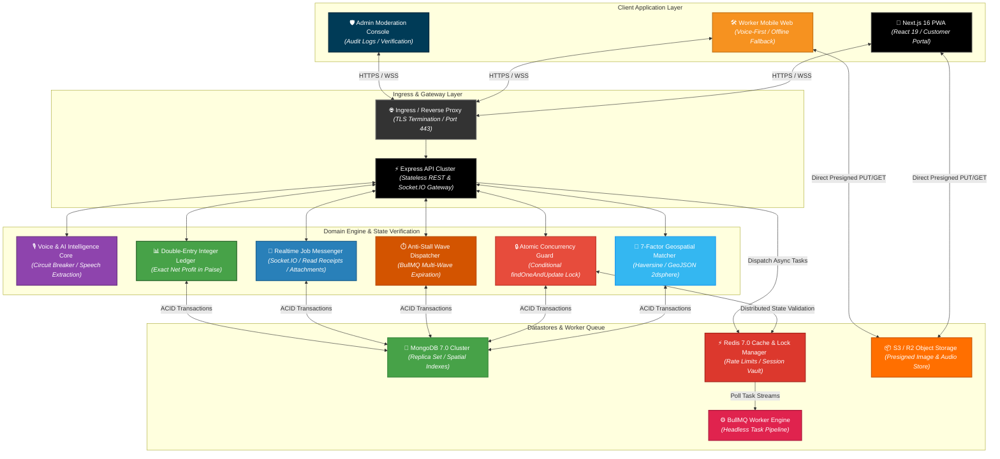
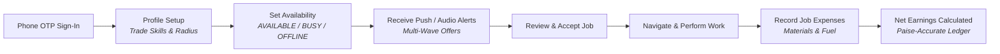
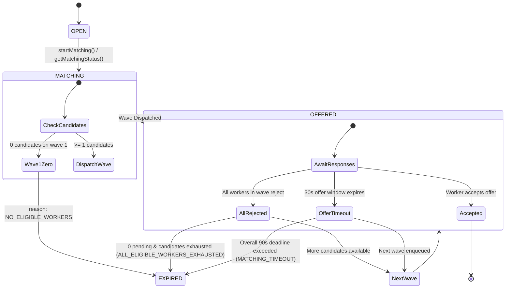

<div align="center">

# 🛠️ KaamSetu (काम सेतु)

### Hyperlocal Skilled-Worker Marketplace, Deterministic Geospatial Matching & Concurrency-Safe Service Architecture

**KaamSetu** is a production-grade, voice-first hyperlocal skilled-trade marketplace connecting households and enterprises with verified professionals (electricians, plumbers, carpenters, mechanics, appliance technicians, and masons). Built on a modern full-stack monorepo featuring **Next.js 16 (React 19)**, **Express**, **MongoDB 7.0 (GeoJSON `2dsphere`)**, **Redis 7.0**, and **BullMQ background workers**, KaamSetu pairs regional voice onboarding with race-condition-safe atomic state transitions, finite anti-stall matching lifecycles, real-time Socket.IO chat, and net-profit financial ledgers.

<p align="center">
  
  
  
  
  
  
  
  
  
  
</p>

<p align="center">
  <a href="https://github.com/shreeharsh-patil/KaamSetu/stargazers"></a>
  <a href="https://github.com/shreeharsh-patil/KaamSetu/issues"></a>
  <a href="LICENSE"></a>
</p>

</div>

---

## 📖 Table of Contents

- [🏛️ System Architecture & Service Mesh](#️-system-architecture--service-mesh)
- [🔄 Core User Lifecycles](#-core-user-lifecycles)
  - [1. Customer Flow (Problem to Completed Service)](#1-customer-flow-problem-to-completed-service)
  - [2. Worker Flow (Onboarding to Net Earnings)](#2-worker-flow-onboarding-to-net-earnings)
  - [3. Admin, Verification & Safety Flow](#3-admin-verification--safety-flow)
- [⏱️ Anti-Stall Matching Engine & Finite Lifecycles](#️-anti-stall-matching-engine--finite-lifecycles)
- [💬 Real-Time Messaging & Communication Architecture](#-real-time-messaging--communication-architecture)
- [🛠️ Production Pipeline Implementation](#️-production-pipeline-implementation)
- [🎯 Target Use Cases](#-target-use-cases)
- [⚡ Key System Features](#-key-system-features)
  - [Deterministic 7-Factor Geospatial Matching Matrix](#-deterministic-7-factor-geospatial-matching-matrix)
- [🎨 Interface Showcase & Application Portals](#-interface-showcase--application-portals)
- [📁 Monorepo Directory Architecture](#-monorepo-directory-architecture)
- [🚀 Local Deployment & Quick Start](#-local-deployment--quick-start)
  - [Prerequisites](#prerequisites)
  - [Option A: Containerized Local Stack (Docker Compose)](#option-a-containerized-local-stack-docker-compose)
  - [Option B: Bare-Metal Monorepo Setup](#option-b-bare-metal-monorepo-setup)
- [🧪 Automated Testing & Concurrency Verification](#-automated-testing--concurrency-verification)
- [🔒 Security Architecture & Hardening](#-security-architecture--hardening)
- [📚 Documentation Index](#-documentation-index)
- [👤 Project Author](#-project-author)

---

## 🏛️ System Architecture & Service Mesh

In emerging markets, skilled and semi-skilled blue-collar tradespeople frequently face barriers when accessing digital work platforms due to complex text interfaces, opaque commissions, and fragmented work history.

**KaamSetu** solves these systemic challenges through a **Decoupled Event-Driven Marketplace Architecture**:

- **Stateless REST & Socket.IO Gateway**: Express handles high-throughput HTTP requests and manages stateful bi-directional WebSocket rooms (`user:${userId}`, `job:${jobId}`, `conversation:${conversationId}`).
- **Asynchronous Task Workers**: Redis-backed BullMQ workers isolate delayed tasks (offer expiration windows, multi-wave dispatching, notification delivery, speech synthesis, and AI classification).
- **Persistent Storage**: MongoDB 7.0 handles transactional document models and GeoJSON `2dsphere` spatial indexing. Redis coordinates rate limits, session rotation families, and distributed locks.
- **Frontend App Router**: Next.js 16 with React 19 provides server-side rendering, client hydration, optimistic cache synchronization via TanStack Query, and offline PWA resilience.



> [!NOTE]
> **Sub-50ms Atomic Lock Assertion**: Job assignment concurrency is governed by conditional MongoDB document updates (`findOneAndUpdate({ _id: jobId, status: 'OFFERED', assignedWorkerId: null }, { $set: { status: 'ACCEPTED', assignedWorkerId: workerId } })`). Benchmarks under 50 simultaneous worker acceptance attempts yield exactly 1 winner (`200 OK`) and 49 conflict rejections (`409 Conflict`) with 0 orphaned states.

---

## 🔄 Core User Lifecycles

### 1. Customer Flow (Problem to Completed Service)

```mermaid
flowchart LR
    A[Describe Issue<br><i>Voice / Text / Photos</i>] --> B[AI Classification<br><i>Category & Urgency</i>]
    B --> C[Publish Job<br><i>Geospatial Radius</i>]
    C --> D[Multi-Wave Matching<br><i>30s Wave Windows</i>]
    D --> E[Worker Accepts<br><i>Atomic Lock</i>]
    E --> F[In-App Chat & Tracking<br><i>Socket.IO / En Route</i>]
    F --> G[Execution & Completion<br><i>Secure OTP Handshake</i>]
    G --> H[Invoice & Review<br><i>Reputation Updated</i>]
```

```mermaid
sequenceDiagram
    autonumber
    actor Cust as Customer
    actor Work as Skilled Professional
    participant API as KaamSetu API Gateway
    participant AI as Audio & Speech Parser
    participant DB as MongoDB 7.0 Cluster
    participant RT as Socket.IO Hub

    Cust->>API: Submit Problem (Voice Note / Form / Photos)
    API->>AI: Transcribe Speech & Extract Parameters
    AI-->>API: Yield Category, Urgency, Budget Suggestion
    API->>DB: Save Job Document (Status: 'OPEN')
    
    rect rgb(20, 30, 20)
        note over API,Work: Multi-Wave Dispatch Window (Max 90s)
        API->>DB: Run 2dsphere Spatial Scan + 7-Factor Ranking
        DB-->>API: Return Top-K Ranked Eligible Workers
        API->>RT: Emit Targeted Job Offer Notification
        RT-->>Work: Push Realtime Offer Notification
    end

    Work->>API: POST /api/v1/offers/:id/accept
    alt First Worker to Respond
        API->>DB: Atomic Conditional Lock (Status: 'ACCEPTED')
        DB-->>API: Lock Confirmed & Other Offers Withdrawn
        API-->>Work: 200 OK (Job Assigned)
        API->>RT: Emit job.accepted & job.status.changed
        RT-->>Cust: Push Alert: Professional Assigned & En Route
    else Concurrent Contenders (Subsequent Taps)
        API->>DB: Atomic Lock Fails (Status != 'OFFERED')
        DB-->>API: Zero Matched Records
        API-->>Work: 409 Conflict ("Offer already claimed or expired")
    end

    Work->>API: POST /api/v1/jobs/:id/start-travel
    Work->>API: POST /api/v1/jobs/:id/arrive
    Work->>API: POST /api/v1/jobs/:id/start
    Work->>API: POST /api/v1/jobs/:id/complete
    API->>Cust: Issue 6-Digit Secure Completion OTP
    Cust->>Work: Provide Physical Completion Code
    Work->>API: POST /api/v1/jobs/:id/verify-otp (Code)
    API->>DB: Validate OTP, Transition to 'COMPLETED'
    API-->>Cust: Settle Invoice & Submit 5-Star Review
```





---

### 2. Worker Flow (Onboarding to Net Earnings)



- **One-Tap Onboarding**: Instant authentication via phone number + OTP with email and profile completion.
- **Availability Control**: Workers toggle `AVAILABLE` to participate in regional dispatch channels.
- **Audio-Assisted Review**: Workers inspect distance, rate compatibility, and listen to synthesized voice descriptions in regional dialects.
- **Expense Logging**: After completion, workers enter out-of-pocket expenses (replacement fixtures, wire spools, toll receipts).
- **Exact Net Profit Computation**:

$$\text{Net Take-Home Profit} = \text{Gross Settled Revenue} - (\text{Material Outlays} + \text{Fuel and Transit Overhead})$$

---

### 3. Admin, Verification & Safety Flow

- **Identity Verification**: Administrators review government IDs (Aadhaar/voter card) and trade certifications to grant verified badges.
- **Dispute Arbitration**: For jobs flagged as `DISPUTED`, admins inspect message transcripts, location stamps, and before/after photos.
- **Immutable Audit Trail**: State transitions, system overrides, and verifications are appended to an immutable append-only event log.

---

## ⏱️ Anti-Stall Matching Engine & Finite Lifecycles

In previous hyperlocal architectures, customers whose requests found no matching workers could get stuck in infinite scanning loops (`"Scanning Nearby Radius..."` forever). KaamSetu enforces a **strict domain-level finite state machine**:



### Key Anti-Stall Guarantees:
1. **Immediate Zero-Worker Termination**: If wave 1 finds zero eligible professionals within the search radius, the job immediately transitions `OPEN -> EXPIRED` with reason `NO_ELIGIBLE_WORKERS` and pushes a `job.status.changed` Socket.IO alert.
2. **Multi-Wave Dispatching**: Offers are dispatched in waves (e.g., 3 workers per wave, 30s per wave). If all workers in a wave reject their offers, the next wave is triggered **immediately** without waiting for the timeout.
3. **90-Second Global Deadline**: BullMQ enqueues a delayed task transitioning unassigned jobs to `EXPIRED` (`MATCHING_TIMEOUT`) if no professional accepts within 90 seconds.
4. **Passive Expiration on Read**: Even if background workers are offline or restarting, querying `GET /api/v1/jobs/:id/matching-status` or `GET /api/v1/jobs/:id` automatically checks `matchingExpiresAt` and marks stale jobs `EXPIRED`.
5. **Pre-filled Recovery Action**: When a job expires, the UI provides **"Try Again with Pre-filled Request"**, using client draft storage to prefill title, description, skills, category, and address coordinates into `/customer/jobs/new`.
6. **Self-Healing Maintenance CLI**:
   ```bash
   pnpm repair:stuck-matching
   ```
   Scans and cleanly expires any legacy unassigned jobs older than 90 seconds.

---

## 💬 Real-Time Messaging & Communication Architecture

KaamSetu features a dedicated, conversation-per-job messaging sub-system:

- **1:1 Conversation Scoping**: Every active job has an associated conversation (`GET /api/v1/jobs/:jobId/conversation`) accessible strictly to the job's customer, assigned worker, or admin.
- **Message Types**: Supports `TEXT`, `IMAGE` (presigned S3 upload), and `LOCATION` coordinates with interactive map cards.
- **Delivery & Read Receipts**: Emits `message.created` and `message.read` over Socket.IO rooms, updating unread badges in real time.
- **Dual Transport Sync**: WebSocket connection with graceful HTTP polling fallback (`5s`) ensures messaging functions even on unstable 2G/3G mobile networks.

---

## 🛠️ Production Pipeline Implementation

| Pipeline Component | Technical Challenge | Enterprise Engineering Solution |
|---|---|---|
| 🛡️ 50-Worker Race Condition | High-density job broadcasts cause race conditions when dozens of workers tap "Accept" simultaneously. | Uses atomic conditional queries (`findOneAndUpdate`) in MongoDB. Benchmarked against 50 concurrent requests: yields exactly 1 winner (`200 OK`) and 49 clean rejections (`409 Conflict`) without duplicate assignments. |
| ⏱️ Anti-Stall Matching | Customers left hanging when workers are unavailable or ignore offers. | Enforces strict multi-wave dispatching with BullMQ delayed queues, immediate wave progression on rejection, 90s deadline, and passive expiration on read. |
| 🎙️ AI Third-Party Outages | Cloud speech-to-text API latency or network timeouts can halt job creation pipelines. | Implements a resilient Circuit Breaker (`ai/circuit-breaker.ts`) that falls back to rule-based keyword matchers if third-party AI APIs become unresponsive. |
| 💰 Financial Precision | JavaScript IEEE-754 floating-point calculations cause rounding discrepancies across financial accounting. | Stores all currency values as 64-bit integer paise (1 INR = 100 paise), computing net take-home margins without precision loss. |
| 📱 Offline Resiliency | Workers on budget devices frequently lose connectivity in basements or remote rural locales. | Deploys a Progressive Web App (PWA) with client-side service worker caches (`/offline`) allowing continuous access to active job addresses and offline logging. |

---

## 🎯 Target Use Cases

| Persona | Operational Scenario | How KaamSetu Solves It |
|---|---|---|
| **Homeowner / Customer** | *Urgent plumbing leak or electrical failure on a weekend.* | Submit problem via voice note or photo. System automatically classifies parameters, dispatches in waves, displays a live visual countdown timer, and connects to in-app chat. |
| **Skilled Worker (Electrician / Plumber)** | *Needs steady job requests without middleman exploitation.* | One-tap phone OTP sign-up. Receives localized audio alerts, accepts work instantly, and logs raw expenses to track true take-home net profit. |
| **Commercial Facility Vendor** | *Facility manager requiring routine maintenance across properties.* | Posts itemized task catalogs, verifies technician accreditation badges, books designated arrival windows, and reconciles digital ledger invoices. |
| **Platform Moderator** | *Identity authentication and transactional dispute arbitration.* | Validates government IDs, audits state transition timestamps, and arbitrates disputes using complete audit trails. |

---

## ⚡ Key System Features

### 📍 Deterministic 7-Factor Geospatial Matching Matrix

Nearby candidate pools are filtered via MongoDB GeoJSON `2dsphere` spatial indexes and scored dynamically:

| Metric Weight | Evaluation Factor | Algorithmic Scrutiny & Criteria |
|---|---|---|
| **30%** | **Skill Match** | Exact match on certified competencies and trade credentials. |
| **25%** | **Distance Proximity** | Great-circle distance calculated via the Haversine formula (up to 50 km). |
| **15%** | **Availability Status** | Realtime worker flag (`AVAILABLE` = 100%, `BUSY` = 30%, `OFFLINE` = 0%). |
| **10%** | **Customer Rating** | Historical rating average weighted by Bayesian confidence intervals. |
| **10%** | **Completion Velocity** | Historical ratio of successfully verified jobs against cancellations. |
| **5%** | **Acceptance Responsiveness** | Worker response speed to recent dispatch offers. |
| **5%** | **Budget Compatibility** | Alignment between worker hourly/base rates and customer budget caps. |

---

## 🎨 Interface Showcase & Application Portals

| Portal / View | Core Capabilities | Highlights |
|---|---|---|
| **Customer Portal** (`/customer`) | • Voice-assisted booking wizard<br>• Real-time matching radar with countdown timer<br>• Live tracking from `EN_ROUTE` to `ARRIVED`<br>• Pre-filled draft recovery on search timeout | • Multi-step form with automatic location detection<br>• Merged, non-duplicated matching status cards<br>• In-app chat with photo and location sharing |
| **Worker Workspace** (`/worker`) | • Instant availability toggle (`AVAILABLE`/`BUSY`)<br>• Incoming job offer radar with distance & pricing<br>• Job execution state buttons (`Start Travel`, `Arrived`)<br>• Expense logger and net profit breakdown | • One-tap acceptance with concurrency lock protection<br>• Audio playback of customer job notes<br>• Itemized material and fuel deduction tracker |
| **Admin & Moderation** (`/admin`) | • Worker accreditation & government ID verification<br>• Dispute arbitration desk with chat history<br>• Dynamic service category and skill catalog manager<br>• Real-time metrics and system health monitoring | • Immutable append-only audit event log viewer<br>• User role management (Customer, Worker, Support, Admin)<br>• Financial platform turnover metrics |
| **Real-Time Chat** (`/messages`) | • Scoped 1:1 job communication channel<br>• Text, image attachments, and GPS cards<br>• Delivery confirmation & read receipts | • Integrated Socket.IO room lifecycle<br>• Responsive chat bubbles with role badges |

---

## 📁 Monorepo Directory Architecture

```text
kaamsetu/
├── backend/                        (Backend Microservices Architecture)
│   ├── apps/
│   │   ├── api/                    (Express HTTP REST & Socket.IO Gateway)
│   │   │   ├── src/
│   │   │   │   ├── modules/        (28 Domain Modules: jobs, matching, job-offers, messages, etc.)
│   │   │   │   ├── database/       (Mongoose ODM, Redis client, transaction wrappers)
│   │   │   │   ├── middlewares/    (RBAC, JWT rotation, rate-limiters, security)
│   │   │   │   ├── realtime/       (Socket.IO gateway, authentication, rooms)
│   │   │   │   ├── scripts/        (repair-stuck-matching.ts, seed scripts)
│   │   │   │   └── server.ts       (Server bootstrap & graceful shutdown hooks)
│   │   │   └── test/               (30 Vitest suites: 510 tests, race conditions, E2E)
│   │   └── worker/                 (Headless BullMQ background processing service)
│   ├── packages/                   (Shared Internal Workspace Packages)
│   │   ├── config/                 (Zod environment validation schemas)
│   │   ├── logger/                 (Structured Pino logging with automated PII masking)
│   │   ├── types/                  (Domain models, DTOs, status enumerations)
│   │   └── validation/             (Zod request schemas & payload contracts)
│   ├── load-tests/                 (k6 load scenarios: 500 to 5,000 virtual users)
│   ├── Dockerfile                  (Multi-stage optimized container build)
│   └── docker-compose.yml          (Backend container orchestration)
│
├── frontend/                       (Next.js 16 Presentation Layer)
│   ├── src/
│   │   ├── app/                    (App Router layouts, routes, error boundaries)
│   │   │   ├── (auth)/             (Phone OTP & Profile onboarding)
│   │   │   ├── (public)/           (Landing page, service catalog, voice AI demo)
│   │   │   ├── customer/           (Customer portal: create, matching radar, live tracking)
│   │   │   ├── worker/             (Worker portal: offers, jobs, ledger, earnings)
│   │   │   ├── admin/              (Admin console: verifications, disputes, audit)
│   │   │   └── messages/           (Real-time in-app chat & conversation rooms)
│   │   ├── components/             (Radix UI primitives & responsive components)
│   │   ├── features/               (Business features: jobs, offers, draft-storage, audio)
│   │   ├── hooks/                  (Custom hooks: useSocket, useGeolocation, useAuth)
│   │   ├── lib/                    (Native fetch apiClient, TanStack query keys, utils)
│   │   └── providers/              (Auth, QueryProvider, SocketQuerySync)
│   └── public/                     (PWA manifest, icons, static assets)
│
├── docker-compose.yml              (Root container orchestration)
├── package.json                    (Root monorepo workspace configuration)
└── README.md
```

---

## 🚀 Local Deployment & Quick Start

### Prerequisites

- **Runtime**: Node.js >= 22.0.0
- **Package Manager**: pnpm >= 9.0.0
- **Databases**: MongoDB 7.0+ (Replica Set enabled for transactions) and Redis 7.0+
- **Container Engine** (Optional): Docker & Docker Compose

---

### Option A: Containerized Local Stack (Docker Compose)

Launch all backend services, database, and Redis cache with one command:

```bash
# 1. Clone repository
git clone https://github.com/shreeharsh-patil/KaamSetu.git
cd KaamSetu

# 2. Spin up containerized infrastructure
docker compose up --build -d

# 3. Verify service health
docker compose ps

# 4. Launch Next.js frontend
pnpm dev:frontend
```

| Service | Address |
|---|---|
| **Frontend Web Application** | [http://localhost:3000](http://localhost:3000) |
| **Express API Gateway** | [http://localhost:5000](http://localhost:5000) |
| **API Health Probe** | [http://localhost:5000/health](http://localhost:5000/health) |
| **Worker Health Probe** | [http://localhost:5001/health](http://localhost:5001/health) |

---

### Option B: Bare-Metal Monorepo Setup

#### 1. Setup Environment Files

```bash
# Copy root environment variables
cp .env.example .env

# Copy frontend environment variables
cp frontend/.env.example frontend/.env.local
```

Essential `.env` configuration:

```ini
PORT=5000
MONGODB_URI="mongodb://localhost:27017/kaamsetu?replicaSet=rs0"
REDIS_URL="redis://localhost:6379"
JWT_ACCESS_SECRET="your_secure_random_jwt_access_secret_min_32_chars"
JWT_REFRESH_SECRET="your_secure_random_jwt_refresh_secret_min_32_chars"
CORS_ORIGINS="http://localhost:3000"
STORAGE_PROVIDER="mock"
```

#### 2. Install Dependencies & Build Packages

```bash
# Install all workspace dependencies
pnpm install

# Build shared internal workspace packages (@kaamsetu/*)
pnpm build:backend
```

#### 3. Seed Initial Service Categories & Skills

```bash
pnpm seed
```

#### 4. Run Development Servers

```bash
# Terminal 1: Launch Express API (hot-reload on :5000)
pnpm dev:backend

# Terminal 2: Launch Next.js Frontend (Turbopack on :3000)
pnpm dev:frontend
```

Access the application in your browser at **[http://localhost:3000](http://localhost:3000)**.

---

## 🧪 Automated Testing & Concurrency Verification

KaamSetu is backed by **30 automated test suites with 510+ tests** spanning unit, integration, high-concurrency race conditions, and finite lifecycle scenarios:

```bash
# Run all backend Vitest suites
pnpm test:backend

# Run matching lifecycle anti-stall test suite specifically
pnpm --filter @kaamsetu/api test test/matching-lifecycle.test.ts

# Generate full backend test coverage report
pnpm test:coverage

# Run frontend tests
pnpm test:frontend
```

### High-Concurrency Benchmark: 50 Simultaneous Workers

Located at `backend/apps/api/test/concurrency-race-conditions.test.ts`:

- Simulates **50 workers simultaneously attempting to accept the exact same job offer** via `Promise.all`.
- Confirms MongoDB's atomic conditional update yields **exactly 1 winner (`200 OK`)** and **49 conflicts (`409 Conflict`)**, preventing duplicate assignments and orphaned states.

### Anti-Stall Matching Lifecycle Tests

Located at `backend/apps/api/test/matching-lifecycle.test.ts`:

- `Scenario 1`: Immediate zero-worker transition `OPEN -> EXPIRED` (`NO_ELIGIBLE_WORKERS`).
- `Scenario 2`: Multi-wave rejection advancing to next candidate and expiring when exhausted (`ALL_ELIGIBLE_WORKERS_EXHAUSTED`).
- `Scenario 3`: Single candidate offer timeout expiring offer and transitioning job to `EXPIRED`.
- `Scenario 4`: Worker acceptance locking state to `ACCEPTED` and rendering subsequent timeouts harmless.
- `Scenario 5`: Atomic resolution of concurrent accept and expire calls without race corruption.
- `Scenario 6`: Passive expiration on read returning `EXPIRED` status.
- `Scenario 7`: `GET /api/v1/jobs/:id/matching-status` endpoint permissions and diagnostic payload.
- `Scenario 8`: `pnpm repair:stuck-matching` maintenance repair script.

### Progressive Load Testing (k6)

```bash
# Full marketplace lifecycle load test (scaling from 500 to 5,000 virtual users)
pnpm load-test

# Target individual endpoints
pnpm load-test:health
pnpm load-test:auth
pnpm load-test:jobs
pnpm load-test:concurrency
```

---

## 🔒 Security Architecture & Hardening

- **Token Family Rotation**: Short-lived access tokens (15 minutes) paired with refresh tokens stored in rotation families; detecting token reuse immediately invalidates all active sessions.
- **Strict Payload Sanitization**: Request bodies, route params, and query strings are sanitized with Zod schemas; unrecognized properties are discarded.
- **Direct-to-Storage Presigned Uploads**: Media streams directly to S3/R2 storage using presigned upload URLs (`POST /api/v1/uploads/presign`), keeping the application server off the binary data path.
- **Automated PII Redaction**: Structured Pino logger automatically masks phone numbers, authentication headers, and tokens from log outputs.
- **Role-Based Access Boundaries**: Strict separation between `CUSTOMER`, `WORKER`, and `ADMIN` routes enforced at middleware layer.

---

## 📚 Documentation Index

| Document | Description |
|---|---|
| [Technical Requirements Document (TRD)](./TRD_Local_Service_Platform.md) | Architectural specifications, matching weights, and non-functional requirements. |
| [Backend Development Roadmap](./Backend_Development_Plan_Phase_Wise.md) | Step-by-step backend phases (Phases 0 through 16). |
| [Frontend Development Roadmap](./Frontend_Development_Plan_Phase_Wise.md) | UI implementation phases (Phases 0 through 22). |
| [Production Deployment Runbook](./DEPLOYMENT.md) | Container setup, Render/cloud configuration, and zero-downtime deployment guidance. |
| [Testing & Concurrency Guide](./TESTING.md) | Race condition test documentation and k6 load testing configurations. |
| [Security Architecture & Audit](./SECURITY.md) | Threat modeling, RBAC validation rules, and vulnerability mitigations. |

---

## 👤 Project Author

**Shreeharsh Patil** — [GitHub Profile](https://github.com/shreeharsh-patil)

---

<div align="center">

⚖️ **Legal Guidelines & License**

> [!NOTE]
> This platform is distributed under the terms of the MIT License. It is an independent engineering project built for hyperlocal marketplace research, distributed concurrency evaluations, and software portfolio benchmarks.

</div>
