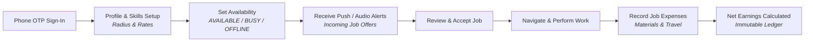

<div align="center">

# 🛠️Hunar

### Hyperlocal Skilled-Worker Marketplace, Deterministic Geospatial Matching & Concurrency-Safe Service Architecture

**Hunar** is an enterprise-grade, voice-first hyperlocal service marketplace engineered to connect customers with verified, skilled trade professionals (electricians, plumbers, carpenters, mechanics, appliance technicians, and masons). Built on a modern full-stack monorepo featuring Next.js 16 (React 19), Express 5, MongoDB 7.0 (GeoJSON `2dsphere`), Redis 7.0, and BullMQ background workers, KaamSetu pairs accessibility-first regional voice onboarding with race-condition-safe atomic state transitions and net-profit financial ledgers.

<p align="center">
  
  
  
  
  
  
  
  
  
</p>

<p align="center">
  <a href="https://github.com/shreeharsh-patil/KaamSetu/stargazers"></a>
  <a href="https://github.com/shreeharsh-patil/KaamSetu/issues"></a>
  <a href="LICENSE"></a>
</p>

</div>

---

## 📖 Table of Contents

- [🏛️ System Architecture & Service Mesh](#-system-architecture--service-mesh)
- [🔄 Core User Lifecycles](#-core-user-lifecycles)
  - [1. Customer Flow (Problem to Completed Service)](#1-customer-flow-problem-to-completed-service)
  - [2. Worker Flow (Onboarding to Net Earnings)](#2-worker-flow-onboarding-to-net-earnings)
  - [3. Admin, Verification & Safety Flow](#3-admin-verification--safety-flow)
- [🛠️ Production Pipeline Implementation](#️-production-pipeline-implementation)
- [🎯 Target Use Cases](#-target-use-cases)
- [âš¡ Key System Features](#-key-system-features)
- [🎨 Interface Showcase](#-interface-showcase)
- [📁 Monorepo Directory Architecture](#-monorepo-directory-architecture)
- [🚀 Local Deployment & Quick Start](#-local-deployment--quick-start)
  - [Prerequisites](#prerequisites)
  - [Option A: Containerized Local Stack (Docker Compose)](#option-a-containerized-local-stack-docker-compose)
  - [Option B: Manual Development Environment](#option-b-manual-development-environment)
- [🧪 Automated Testing & Concurrency Validation](#-automated-testing--concurrency-validation)
- [🔒 Security Architecture & Hardening](#-security-architecture--hardening)
- [📚 Documentation Index](#-documentation-index)
- [👤 Project Author](#-project-author)

---

## 🏛️ System Architecture & Service Mesh

In many emerging markets, skilled and semi-skilled blue-collar workers face severe barriers when accessing digital work platforms due to complex English-only text interfaces, opaque fee structures, and lack of verified digital reputation.

**KaamSetu** solves these systemic problems through a **Decoupled Event-Driven Marketplace Architecture**. The stateless Express 5 API handles high-throughput HTTP/WebSocket requests, while Redis-backed BullMQ workers isolate asynchronous background processing (notifications, SMS alerts, audio synthesis, and AI classification). Database persistence is partitioned across MongoDB 7.0 for document and geospatial vector models, and Redis for distributed atomic locks, session state, and rate limiting.

```mermaid
graph TD
    subgraph Client Application Layer
        A1["📱 Next.js 16 PWA <br><i>(React 19 / Customer Portal)</i>"]
        A2["🛠️ Worker Mobile Web <br><i>(Voice-First / Offline Fallback)</i>"]
        A3["🛡️ Admin Moderation Console <br><i>(Audit Logs / Verification)</i>"]
    end

    subgraph Ingress & Gateway Layer
        B["🌐 Ingress / Reverse Proxy <br><i>(TLS Termination / Port 443)</i>"]
        C["âš¡ Express.js 5 API Cluster <br><i>(Stateless REST & Socket.IO Gateway)</i>"]
    end

    subgraph Domain Engine & State Verification
        D1["🎙️ Voice & AI Intelligence Core <br><i>(Circuit Breaker / Speech Extraction)</i>"]
        D2["📍 7-Factor Geospatial Matcher <br><i>(Haversine / GeoJSON 2dsphere)</i>"]
        D3["🔒 Atomic Concurrency Guard <br><i>(Conditional findOneAndUpdate Lock)</i>"]
        D4["📊 Double-Entry Integer Ledger <br><i>(Exact Net Profit in Paise)</i>"]
    end

    subgraph Datastores & Worker Queue
        E["💾 MongoDB 7.0 Cluster <br><i>(Replica Set / Spatial Indexes)</i>"]
        F["âš¡ Redis 7.0 Cache & Lock Manager <br><i>(Rate Limits / Session Vault)</i>"]
        G["⚙️ BullMQ Worker Engine <br><i>(Headless Task Pipeline)</i>"]
        H["📦 S3 / R2 Object Storage <br><i>(Presigned Image & Audio Store)</i>"]
    end

    A1 & A2 & A3 <-->|HTTPS / WSS| B
    B --> C
    C <--> D1 & D2 & D3 & D4
    D3 <-->|Distributed State Validation| F
    D2 & D3 & D4 <-->|ACID Transactions| E
    C -->|Dispatch Async Tasks| F
    F -->|Poll Task Streams| G
    A1 & A2 <-->|Direct Presigned PUT/GET| H

    style A1 fill:#000000,stroke:#333,stroke-width:2px,color:#fff
    style A2 fill:#F69220,stroke:#c47214,stroke-width:2px,color:#fff
    style A3 fill:#003B57,stroke:#002538,stroke-width:2px,color:#fff
    style B fill:#333333,stroke:#666,stroke-width:2px,color:#fff
    style C fill:#000000,stroke:#333,stroke-width:2px,color:#fff
    style D1 fill:#8E44AD,stroke:#6c3483,stroke-width:2px,color:#fff
    style D2 fill:#34B7F1,stroke:#209CEE,stroke-width:2px,color:#fff
    style D3 fill:#e74c3c,stroke:#c0392b,stroke-width:2px,color:#fff
    style D4 fill:#47A248,stroke:#2d662e,stroke-width:2px,color:#fff
    style E fill:#47A248,stroke:#3f8a40,stroke-width:2px,color:#fff
    style F fill:#DC382D,stroke:#a62319,stroke-width:2px,color:#fff
    style G fill:#E0234E,stroke:#aa1638,stroke-width:2px,color:#fff
    style H fill:#FF6F00,stroke:#cc5800,stroke-width:2px,color:#fff
```



> [!NOTE]
> Sub-50ms Lock Assertion: Job assignment concurrency is governed by conditional MongoDB document version checks (`findOneAndUpdate({ _id: jobId, status: 'OPEN' }, { $set: { status: 'ACCEPTED', workerId } })`). This entirely eliminates duplicate assignments across high-traffic broadcast channels.

---

## 🔄 Core User Lifecycles

### 1. Customer Flow (Problem to Completed Service)

```mermaid
flowchart LR
    A[Describe Issue<br><i>Voice / Text / Photos</i>] --> B[AI Classification<br><i>Category & Urgency</i>]
    B --> C[Publish Job<br><i>Geospatial Radius</i>]
    C --> D[Matching Engine<br><i>Scores Nearby Workers</i>]
    D --> E[Worker Accepts<br><i>Atomic Lock</i>]
    E --> F[Realtime Tracking<br><i>En Route âž” Arrived</i>]
    F --> G[Execution & Completion<br><i>Secure OTP Handshake</i>]
    G --> H[Payment & Review<br><i>Reputation Updated</i>]
```



The sequence blueprint below details the complete communication and execution lifecycle:

```mermaid
sequenceDiagram
    autonumber
    actor Cust as Customer
    actor Work as Skilled Professional
    participant API as KaamSetu Express Gateway
    participant AI as Audio & Speech Parser
    participant DB as MongoDB 7.0 Cluster
    participant RT as Socket.IO Hub

    Cust->>API: Submit Problem (Voice Audio Note / Photo)
    API->>AI: Transcribe Speech & Extract Parameters
    AI-->>API: Yield Category (Plumbing), Urgency (High), Base Budget
    API->>DB: Save Job Document (Status: 'OPEN')
    
    rect rgb(20, 30, 20)
        note over API,Work: Geospatial Broadcast Window
        API->>DB: Run 2dsphere Spatial Scan + 7-Factor Ranking
        DB-->>API: Return Top-K Ranked Eligible Workers
        API->>RT: Emit Targeted Job Offer Alert
        RT-->>Work: Broadcast Incoming Work Notification
    end

    Work->>API: POST /api/v1/jobs/:id/accept
    alt First Worker to Respond
        API->>DB: Atomic Conditional Lock (Status: 'ACCEPTED')
        DB-->>API: Lock Confirmed
        API-->>Work: Return 200 OK (Job Assignment Assigned)
        API->>RT: Establish Private Communication Room & Broadcast Status
        RT-->>Cust: Push Alert: Worker Assigned & En Route
    else Concurrent Contenders (Subsequent Taps)
        API->>DB: Atomic Lock Attempt Fails (Status != 'OPEN')
        DB-->>API: Zero Matched Records
        API-->>Work: Return 409 Conflict ("Job already accepted")
    end

    Work->>API: Update Status: 'ARRIVED' âž” 'IN_PROGRESS'
    Work->>API: Request Completion Verification Handshake
    API->>Cust: Generate 6-Digit Secure Completion OTP
    Cust->>Work: Provide Physical Completion Code
    Work->>API: POST /api/v1/jobs/:id/verify-otp (Code)
    API->>DB: Validate OTP, Mutate Status to 'COMPLETED'
    API-->>Cust: Prompt Review, Star Rating & Settle Invoice
```



---

### 2. Worker Flow (Onboarding to Net Earnings)



- **Fast Onboarding**: Login with phone number + OTP; configure trade skills, hourly/flat rates, and target travel radius.
- **Availability Control**: Workers toggle `AVAILABLE` to participate in regional dispatch channels.
- **Audio-Assisted Review**: Workers inspect distance, rate compatibility, and listen to synthesized voice descriptions in regional dialects.
- **Expense Logging**: After completion, workers enter out-of-pocket expenses (replacement fixtures, wire spools, toll receipts).
- **Net Profit Computation**:

$$\text{Net Take-Home Profit} = \text{Gross Settled Revenue} - (\text{Material Outlays} + \text{Fuel \& Transit Overhead})$$

---

### 3. Admin, Verification & Safety Flow

- **Identity Verification**: Administrators review Aadhaar/voter ID documents and trade credentials prior to issuing verified digital trust badges.
- **Dispute Arbitration**: Jobs flagged as `DISPUTED` provide admins with historical conversation transcripts, location timestamps, and image proofs.
- **Immutable Audit Trail**: System modifications, suspensions, and verifications append to an immutable log collection.

---

## 🛠️ Production Pipeline Implementation

| Pipeline Component | Technical Challenge | Enterprise Engineering Solution |
|---|---|---|
| 🛡️ 50-Worker Race Condition | High-density job broadcasts cause race conditions when dozens of workers tap "Accept" simultaneously. | Uses atomic conditional queries (`findOneAndUpdate`) in MongoDB. Benchmarked against 50 concurrent requests: yields exactly 1 winner (200 OK) and 49 clean rejections (409 Conflict) without duplicate assignments. |
| 🎙️ AI Third-Party Outages | Cloud speech-to-text API latency or network timeouts can halt job creation pipelines. | Implements a resilient Circuit Breaker (`ai/circuit-breaker.ts`) that falls back to rule-based keyword matchers if third-party AI APIs become unresponsive. |
| 💰 Financial Precision | JavaScript IEEE-754 floating-point calculations cause rounding discrepancies across financial accounting. | Stores all currency values as 64-bit integer paise ($1\text{ INR} = 100\text{ paise}$), computing net take-home margins without precision loss. |
| 📍 Offline Resiliency | Workers on budget devices frequently lose connectivity in basements or remote rural locales. | Deploys a Progressive Web App (PWA) with client-side service worker caches (`/offline`) allowing continuous access to active job addresses and offline logging. |

---

## 🎯 Target Use Cases

| Persona | Operational Scenario | How KaamSetu Solves It |
|---|---|---|
| **Homeowner / Customer** | *Urgent plumbing leak or electrical failure on a weekend.* | Submit problem via voice note or photo. System automatically classifies problem parameters and broadcasts to verified technicians within 5–10 km with real-time tracking. |
| **Skilled Worker (Electrician / Plumber)** | *Needs steady job requests without platform fee exploitation.* | One-tap phone OTP sign-up. Reviews incoming jobs translated to preferred regional language, accepts work instantly, and logs raw expenses to track true net profit. |
| **Commercial Facility Vendor** | *Facility manager requiring routine maintenance across properties.* | Posts itemized task catalogs, verifies technician accreditation badges, books designated arrival windows, and reconciles digital ledger invoices. |
| **Platform Moderator** | *Identity authentication and transactional dispute arbitration.* | Validates government IDs, audits state transition timestamps, and arbitrates disputes using complete audit trails. |

---

## âš¡ Key System Features

### 📍 Deterministic 7-Factor Geospatial Matching Matrix

Nearby candidate pools are filtered via MongoDB GeoJSON `2dsphere` spatial indexes and scored dynamically:

| Metric Weight | Evaluation Factor | Algorithmic Scrutiny & Criteria |
|---|---|---|
| 30% | Skill Match | Exact match on certified competencies and trade credentials. |
| 25% | Distance Proximity | Great-circle distance calculated via the Haversine formula. |
| 15% | Availability Status | Realtime worker flag (`AVAILABLE` = 100%, `BUSY` = 30%, `OFFLINE` = 0%). |
| 10% | Customer Rating | Historical rating average weighted by Bayesian confidence intervals. |
| 10% | Completion Velocity | Historical ratio of successfully verified jobs against cancellations. |
| 5% | Acceptance Responsiveness | Worker response speed to recent dispatch offers. |
| 5% | Budget Compatibility | Alignment between worker hourly/base rates and customer budget caps. |

---

## 🎨 Interface Showcase

*(Screenshots and UI demos to be added here)*

---

## 📁 Monorepo Directory Architecture

```
kaamsetu/
├── backend/                        (Backend Microservices Architecture)
│   ├── apps/
│   │   ├── api/                    (Express HTTP REST & Socket.IO Gateway)
│   │   │   ├── src/
│   │   │   │   ├── modules/        (28 Domain Modules: jobs, matching, ledger, auth, etc.)
│   │   │   │   ├── database/       (Mongoose ODM & Redis client managers)
│   │   │   │   ├── middlewares/    (RBAC, JWT family validation, rate-limiters)
│   │   │   │   ├── realtime/       (Socket.IO room gateways & geolocation broadcasts)
│   │   │   │   └── server.ts       (Server bootstrap & graceful shutdown hooks)
│   │   │   └── test/               (26 Vitest test suites: race conditions, units, E2E)
│   │   └── worker/                 (Headless BullMQ background processing service)
│   ├── packages/                   (Shared Internal Workspace Packages)
│   │   ├── config/                 (Zod environment validation schemas)
│   │   ├── logger/                 (Structured Pino logging with automated PII masking)
│   │   ├── types/                  (Domain models, DTOs, status enumerations)
│   │   └── validation/             (Zod request schemas & payload contracts)
│   ├── load-tests/                 (k6 load scenarios: 500 to 5,000 virtual users)
│   ├── Dockerfile                  (Multi-stage optimized container build)
│   └── docker-compose.yml          (Backend container orchestration)
│
├── frontend/                       (Next.js 16 Presentation Layer)
│   ├── src/
│   │   ├── app/                    (App Router layouts, routes, and error boundaries)
│   │   │   ├── (auth)/             (Phone OTP authentication routes)
│   │   │   ├── (public)/           (Landing page, service catalog, voice demo)
│   │   │   ├── customer/           (Customer portal: create jobs, track workers, review)
│   │   │   ├── worker/             (Worker workspace: broadcast radar, active jobs, ledger)
│   │   │   ├── admin/              (Admin dashboard: verification, disputes, audit logs)
│   │   │   └── offline/            (PWA offline fallback view)
│   │   ├── components/             (Radix UI primitives & responsive components)
│   │   ├── features/               (Feature logic: matching, audio recording, ledgers)
│   │   ├── hooks/                  (Custom hooks: useGeolocation, useSocket, useVoiceAI)
│   │   ├── lib/                    (Axios client, TanStack Query providers)
│   │   └── providers/              (Auth Context, Realtime Socket Context)
│   └── public/                     (PWA manifest, icons, static assets)
│
├── docker-compose.yml              (Root container orchestration)
├── TRD_Local_Service_Platform.md   (Technical Requirements Document)
├── DEPLOYMENT.md                   (Production cloud deployment runbooks)
├── TESTING.md                      (Test catalog & concurrency verification guide)
└── SECURITY.md                     (Security architecture & audit documentation)
```

---

## 🚀 Local Deployment & Quick Start

### Prerequisites

- **Runtime**: Node.js >= 22.0.0
- **Package Manager**: pnpm >= 11.0.0
- **Container Engine**: Docker & Docker Compose (recommended for local dependencies)
- **Databases** (if running bare-metal): MongoDB 7.0+, Redis 7.0+

### Option A: Containerized Local Stack (Docker Compose)

Launch the entire stack (MongoDB, Redis, Express API on `:5000`, and Worker on `:5001`) with a single command:

```bash
# 1. Clone repository
git clone https://github.com/shreeharsh-patil/KaamSetu.git
cd KaamSetu

# 2. Spin up containerized infrastructure
docker compose up --build -d

# 3. Verify service health
docker compose ps

# 4. Launch Next.js frontend
cd frontend
pnpm install
pnpm dev
```

| Service | URL |
|---|---|
| Frontend Web Application | http://localhost:3000 |
| Backend Health Check | http://localhost:5000/health |
| Background Worker Health | http://localhost:5001/health |

### Option B: Manual Development Environment

#### 1. Allocate Environment Variables

```bash
cp .env.example .env
cp frontend/.env.example frontend/.env.local
```

Key environment configurations:

```ini
PORT=5000
MONGODB_URI="mongodb://localhost:27017/kaamsetu"
REDIS_URL="redis://localhost:6379"
JWT_ACCESS_SECRET="your_secure_random_jwt_access_secret_min_32_chars"
JWT_REFRESH_SECRET="your_secure_random_jwt_refresh_secret_min_32_chars"
CORS_ORIGINS="http://localhost:3000"
STORAGE_PROVIDER="mock"
```

#### 2. Install Dependencies & Launch Backend

```bash
# Install root monorepo dependencies
pnpm install

# Start Express API in hot-reload mode
pnpm dev:backend

# (Optional Terminal 2) Start BullMQ background worker
cd backend/apps/worker
pnpm dev
```

#### 3. Launch Frontend Development Server

```bash
# Terminal 3
cd frontend
pnpm install
pnpm dev
```

Application runs live at: http://localhost:3000

---

## 🧪 Automated Testing & Concurrency Validation

KaamSetu is backed by over 450+ automated unit, integration, and high-concurrency test suites:

```bash
# Run all backend Vitest suites
pnpm test:backend

# Generate backend test coverage reports
pnpm --filter @kaamsetu/api test:coverage

# Run frontend tests
pnpm test:frontend
```

### Race Condition Validation Suite

Located at `backend/apps/api/test/concurrency-race-conditions.test.ts`:

- Simulates **50 workers simultaneously accepting the exact same job offer** via `Promise.all`.
- Confirms that MongoDB's atomic find-and-modify permits **exactly 1 winner (200 OK)** and **49 conflicts (409 Conflict)**, avoiding duplicate assignments and orphaned states.

### Progressive Load Testing (k6)

```bash
# Execute end-to-end load tests (scaling from 500 to 5,000 virtual users)
pnpm load-test

# Target individual endpoints
pnpm load-test:health
pnpm load-test:auth
pnpm load-test:jobs
pnpm load-test:concurrency
```

---

## 🔒 Security Architecture & Hardening

- **Token Family Revocation**: Short-lived access tokens (15 minutes) paired with refresh tokens tracked in rotation families; detecting reuse immediately invalidates all active sessions.
- **Strict Runtime Verification**: Request payloads, route parameters, and query strings are sanitized with Zod schemas; unrecognized properties are discarded.
- **Direct-to-Storage Presigned Uploads**: Client media streams directly to S3/R2 object storage using presigned upload URLs (`POST /api/v1/uploads/presign`), keeping the web application server off the binary data path.
- **Automated PII Redaction**: The structured Pino logger automatically masks phone numbers, authentication headers, and session tokens from stdout and log streams.

---

## 📚 Documentation Index

| Document | Description |
|---|---|
| [Technical Requirements Document (TRD)](./TRD_Local_Service_Platform.md) | Architectural specifications, matching weights, and non-functional requirements. |
| [Backend Development Roadmap](./Backend_Development_Plan_Phase_Wise.md) | Step-by-step backend phases (Phases 0 through 16). |
| [Frontend Development Roadmap](./Frontend_Development_Plan_Phase_Wise.md) | UI implementation phases (Phases 0 through 22). |
| [Production Deployment Runbook](./DEPLOYMENT.md) | Container setup, Kubernetes manifests, and zero-downtime deployment guidance. |
| [Testing & Concurrency Guide](./TESTING.md) | Race condition test documentation and k6 load testing configurations. |
| [Security Architecture & Audit](./SECURITY.md) | Threat modeling, RBAC validation rules, and vulnerability mitigations. |

---

## 👤 Project Author

**Shreeharsh Patil** — [GitHub](https://github.com/shreeharsh-patil)

---

<div align="center">

⚖️ **Legal Guidelines & License**

> [!WARNING]
> This platform is distributed under the terms of the MIT License. It is an independent engineering project built for hyperlocal marketplace research, distributed concurrency evaluations, and software portfolio benchmarks.

</div>
