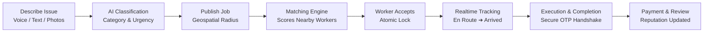
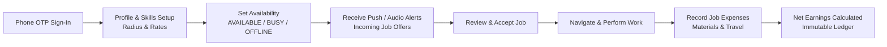

# KaamSetu (कामसेतु) 🛠️

> **Hyperlocal skilled-worker service platform connecting customers with verified local service professionals.**

[](https://nodejs.org/)
[](https://pnpm.io/)
[](https://nextjs.org/)
[](https://react.dev/)
[](https://expressjs.com/)
[](https://www.mongodb.com/)
[](https://redis.io/)
[](https://bullmq.io/)
[](https://socket.io/)

---

## 📖 Table of Contents

- [Overview & Vision](#-overview--vision)
- [Target Use Cases](#-target-use-cases)
- [Core User Flows](#-core-user-flows)
  - [1. Customer Flow (Problem to Completed Service)](#1-customer-flow-problem-to-completed-service)
  - [2. Worker Flow (Onboarding to Net Earnings)](#2-worker-flow-onboarding-to-net-earnings)
  - [3. Admin & Safety Flow](#3-admin--safety-flow)
- [Key Features](#-key-features)
- [Architecture & Tech Stack](#-architecture--tech-stack)
- [Repository Structure](#-repository-structure)
- [Getting Started](#-getting-started)
  - [Prerequisites](#prerequisites)
  - [Option A: Docker Local Stack (Recommended)](#option-a-docker-local-stack-recommended)
  - [Option B: Manual Local Setup](#option-b-manual-local-setup)
- [Automated Testing & Concurrency Validation](#-automated-testing--concurrency-validation)
- [Security & Production Hardening](#-security--production-hardening)
- [Documentation Index](#-documentation-index)

---

## 🌟 Overview & Vision

In many emerging markets, skilled and semi-skilled blue-collar workers—such as electricians, plumbers, carpenters, mechanics, appliance repairers, and masons—face severe barriers when accessing digital work platforms due to complex English-only text interfaces, opaque fee structures, and lack of verified digital reputation.

**KaamSetu** bridges this gap as an accessible, voice-first, hyperlocal marketplace:
1. **Accessibility First**: Phone-first authentication (OTP), regional languages, and voice-assisted problem description and job translation.
2. **Deterministic Matching**: Geospatial matching (Haversine & MongoDB 2dsphere) scored against proximity, verified skills, availability, ratings, and rates.
3. **Net Profit Transparency**: Built-in financial ledger tracking not just gross job revenue, but worker materials, fuel, and travel expenses to show **actual take-home profit**.
4. **Reliability & Concurrency Safety**: Guaranteed finite state transitions, atomic acceptance locks (preventing race conditions when multiple workers accept simultaneously), and realtime Socket.IO status updates.

---

## 🎯 Target Use Cases

| Persona | Scenario | How KaamSetu Solves It |
|---|---|---|
| **Homeowner / Customer** | *Urgent plumbing leak or broken AC on a hot weekend.* | Uses voice or photo to describe the problem. AI auto-classifies the service, sets urgency, and broadcasts to available verified workers within 5–10 km. Customer tracks the worker en route in real time. |
| **Skilled Worker (Electrician / Plumber)** | *Needs steady local job requests without platform exploitation.* | Signs up in minutes using phone OTP and regional voice prompt. Sets availability toggle (`AVAILABLE` / `BUSY`). Reviews incoming jobs translated to preferred language, accepts work, and logs project expenses to see actual daily net profit. |
| **Local Commercial Vendor** | *Facility manager needing multiple carpentry and repair tasks.* | Posts itemized task lists, reviews worker identity verification badges, sets scheduled time slots, and settles records transparently. |
| **Platform Moderator / Admin** | *Identity verification and dispute resolution.* | Reviews worker ID documents, inspects audit logs for suspicious activity, and arbitrates disputed jobs with complete state transition logs. |

---

## 🔄 Core User Flows

### 1. Customer Flow (Problem to Completed Service)



1. **Create Job**: Customer enters issue via voice note or text. AI parses and extracts required skills, urgency, and estimated cost.
2. **Matching & Dispatch**: System discovers verified, available workers nearby and emits job offers.
3. **Acceptance**: The first worker to accept secures the job via an atomic lock. Both parties enter a private messaging and realtime tracking room.
4. **Execution & OTP Completion**: The worker transitions state (`EN_ROUTE` $\to$ `ARRIVED` $\to$ `IN_PROGRESS`). Upon finishing, customer verifies completion via an OTP handshake.
5. **Review & Payment**: Customer rates the worker (1–5 stars with review tags) and records payment method.

---

### 2. Worker Flow (Onboarding to Net Earnings)



1. **Fast Onboarding**: Login with phone number + OTP; set trade skills, hourly/flat rates, and travel radius.
2. **Availability Toggle**: Workers switch to `AVAILABLE` to start receiving nearby broadcast offers.
3. **Offer Review**: Worker inspects job location, distance, estimated price, and simplified audio description.
4. **Expense Logging**: After job completion, worker logs expenses (e.g., replacement pipes, wire spools, toll fees).
5. **Ledger & Payout**: The system computes net profit:
   $$\text{Net Profit} = \text{Total Received} - \text{Total Material \& Travel Expenses}$$

---

### 3. Admin & Safety Flow

- **Document Verification**: Admins review government ID proofs and trade certificates.
- **Dispute Resolution**: If a job is marked `DISPUTED`, admins inspect conversation history, timestamps, and job events before resolving.
- **Append-Only Audit Logs**: Every administrative action (suspension, verification, role modification) is recorded in immutable audit logs.

---

## ⚡ Key Features

### 🎙️ Voice-First & Regional Language AI
- **Voice Descriptions**: Speech-to-text integration transcribes customer voice recordings and extracts job parameters.
- **Circuit Breaker Resilience**: AI calls are protected by a circuit breaker (`ai/circuit-breaker.ts`) with deterministic fallbacks, ensuring the marketplace works even if third-party AI APIs are down.
- **Multilingual Support**: Supports job translation into major Indian regional languages.

### 📍 Deterministic 7-Factor Geospatial Matching
Candidates are filtered via MongoDB GeoJSON `2dsphere` indexes and ranked by a deterministic scoring formula:
1. **Skill Match (30%)** — Exact match of required certifications/skills.
2. **Distance Proximity (25%)** — Calculated via Haversine great-circle distance.
3. **Availability Status (15%)** — Realtime status (`AVAILABLE` = 100%, `BUSY` = 30%, `OFFLINE` = 0%).
4. **Customer Rating (10%)** — Historical review score average.
5. **Job Completion Rate (10%)** — Ratio of successfully completed vs. cancelled jobs.
6. **Offer Acceptance Rate (5%)** — Worker responsiveness to previous offers.
7. **Price Compatibility (5%)** — Worker hourly/base rate alignment with customer budget.

### 🛡️ High-Concurrency Race Condition Safety
- Tested and proven against **50 concurrent workers** tapping "Accept" simultaneously on the same job.
- Utilizes MongoDB atomic conditional `findOneAndUpdate` queries ensuring **exactly 1 winner (200 OK)** and **49 conflicts (409 Conflict)**, eliminating double-assignment bugs.

### 📊 Double-Entry Financial Ledger
- All currency values stored as integer **paise** (1 INR = 100 paise) to eliminate JavaScript IEEE-754 floating-point errors.
- Realtime tracking of Gross Earnings, Deductions, Material Expenses, and Net Profit.

### 🔌 Realtime WebSockets (Socket.IO)
- Authenticated JWT socket connections.
- Instant alerts for new matching offers, status transitions (`EN_ROUTE`, `ARRIVED`), and in-job chat with delivery receipts.

### 📱 Progressive Web App (PWA)
- Next.js 16 PWA with offline fallback caching (`/offline`) designed for budget Android devices on unstable 3G/4G connections.

---

## 🏛️ Architecture & Tech Stack

```
                              Client Devices (Next.js 16 PWA)
                                             │
                                     HTTPS / WSS (Port 443)
                                             ▼
                              ┌─────────────────────────────┐
                              │  Reverse Proxy / Ingress    │
                              └──────────────┬──────────────┘
                                             │
                     ┌───────────────────────┴───────────────────────┐
                     ▼                                               ▼
         ┌────────────────────────┐                     ┌────────────────────────┐
         │   Express API Pod 1    │                     │   Express API Pod N    │
         │ (Stateless HTTP/WSS)   │                     │ (Stateless HTTP/WSS)   │
         └───────────┬────────────┘                     └───────────┬────────────┘
                     │                                               │
        ┌────────────┼───────────────────────────┬───────────────────┘
        │            │                           │
        ▼            ▼                           ▼
  ┌───────────┐┌─────────────┐         ┌───────────────────┐
  │  MongoDB  ││    Redis    │         │  Object Storage   │
  │   Atlas   ││ (Cache/MQ)  │         │  (S3 / R2 / Mock) │
  └───────────┘└──────┬──────┘         └───────────────────┘
                      │ BullMQ Queues
                      ▼
         ┌────────────────────────┐
         │    BullMQ Worker Pod   │
         │ (Headless Background)  │
         └────────────────────────┘
```

| Component | Technology | Role |
|---|---|---|
| **Frontend** | Next.js 16 (React 19), Tailwind CSS, Radix UI, TanStack Query | Progressive Web App for Customers, Workers, and Admins |
| **Backend API** | Node.js 22, Express.js 5, TypeScript | Stateless REST API + Socket.IO realtime server |
| **Worker Process** | BullMQ + Redis | Dedicated background process for notifications and audio tasks |
| **Database** | MongoDB 7.0 + Mongoose | Primary document store with GeoJSON `2dsphere` spatial indexing |
| **Cache & Queue** | Redis 7.0 | Rate-limiting, session tokens, and BullMQ task queues |
| **Validation** | Zod | End-to-end runtime request validation and env parsing |
| **Logging** | Pino | Structured JSON logging with automatic PII redaction |

---

## 📁 Repository Structure

```
.
├── backend/                       # Backend Monorepo Services
│   ├── apps/
│   │   ├── api/                   # Express HTTP API & Socket.IO Gateway
│   │   │   ├── src/
│   │   │   │   ├── modules/       # 28 Domain modules (jobs, auth, matching, ledger, etc.)
│   │   │   │   ├── database/      # Mongoose and Redis connection managers
│   │   │   │   ├── middlewares/   # Security, RBAC auth, rate limiting, error handlers
│   │   │   │   ├── realtime/      # Socket.IO gateway and room management
│   │   │   │   └── server.ts      # API bootstrap & graceful shutdown
│   │   │   └── test/              # 26 Vitest test suites (concurrency, unit, E2E)
│   │   └── worker/                # Headless BullMQ worker process (notifications, AI)
│   ├── packages/                  # Internal Shared Packages
│   │   ├── config/                # Environment validation schemas (Zod)
│   │   ├── logger/                # Pino logger with redaction
│   │   ├── types/                 # Shared domain interfaces, enums, DTOs
│   │   └── validation/            # Zod request validators
│   ├── load-tests/                # k6 progressive load test scenarios
│   ├── Dockerfile                 # Multi-stage production container build
│   └── docker-compose.yml         # Backend container orchestration
│
├── frontend/                      # Next.js 16 Progressive Web App
│   ├── src/
│   │   ├── app/                   # App Router pages
│   │   │   ├── (auth)/            # Login & OTP verification routes
│   │   │   ├── (public)/          # Marketing, services list, voice AI demo
│   │   │   ├── customer/          # Customer dashboard, job creation, matching
│   │   │   ├── worker/            # Worker portal, offers, active jobs, earnings
│   │   │   ├── admin/             # Verification, disputes, user control, audit
│   │   │   └── offline/           # PWA offline fallback
│   │   ├── components/            # UI components (Radix, Tailwind, custom dialogs)
│   │   ├── features/              # Modular domain UI logic (auth, jobs, matching, reviews)
│   │   ├── hooks/                 # Custom React hooks (geolocation, socket, audio)
│   │   ├── lib/                   # API HTTP client, React Query config
│   │   └── providers/             # Global Context Providers (Auth, Socket, Query)
│   └── public/                    # PWA manifest, icons, static assets
│
├── docker-compose.yml             # Root local orchestration
├── TRD_Local_Service_Platform.md  # Detailed Technical Requirements Document
├── DEPLOYMENT.md                  # Cloud deployment runbooks
├── TESTING.md                     # Concurrency proofs & testing catalog
└── SECURITY.md                    # Security policies & audit documentation
```

---

## 🚀 Getting Started

### Prerequisites
- **Node.js**: `>= 22.0.0`
- **pnpm**: `>= 11.0.0`
- **Docker & Docker Compose**: (Optional, for running containers)
- **MongoDB**: `7.0+` (if running locally without Docker)
- **Redis**: `7.0+` (if running locally without Docker)

---

### Option A: Docker Local Stack (Recommended)

Spins up MongoDB, Redis, the Express API (`:5000`), and the Background Worker (`:5001`) with a single command:

```bash
# 1. Clone repository
git clone https://github.com/your-org/kaamsetu.git
cd kaamsetu

# 2. Start all backend services in containers
docker compose up --build -d

# 3. Check health of services
docker compose ps

# 4. In a separate terminal, launch the frontend
cd frontend
npm install
npm run dev
```

Visit:
- **Frontend App**: [http://localhost:3000](http://localhost:3000)
- **Backend Health Check**: [http://localhost:5000/health](http://localhost:5000/health)
- **Worker Health Check**: [http://localhost:5001/health](http://localhost:5001/health)

---

### Option B: Manual Local Setup

#### 1. Configure Environment Variables
Copy `.env.example` in both root and `frontend/`:
```bash
cp .env.example .env
cp frontend/.env.example frontend/.env.local
```

Key environment variables:
```env
PORT=5000
MONGODB_URI=mongodb://localhost:27017/kaamsetu
REDIS_URL=redis://localhost:6379
JWT_ACCESS_SECRET=your_super_secret_jwt_access_key_min_32_chars_long
JWT_REFRESH_SECRET=your_super_secret_jwt_refresh_key_min_32_chars_long
CORS_ORIGINS=http://localhost:3000
STORAGE_PROVIDER=mock
```

#### 2. Install & Start Backend Services
```bash
# From repository root
pnpm install

# Start Express API in dev mode (hot reload)
pnpm dev:backend

# (Optional) In another terminal, run background worker
cd backend/apps/worker
pnpm dev
```

#### 3. Start Frontend Development Server
```bash
# In another terminal
cd frontend
npm install
npm run dev
```

Open [http://localhost:3000](http://localhost:3000) in your browser.

---

## 🧪 Automated Testing & Concurrency Validation

The platform includes exhaustive testing across domain unit logic, finite state transitions, high-concurrency race conditions, and load limits.

```bash
# Run all backend Vitest suites (450+ tests across 26 test suites)
pnpm test:backend

# Run test coverage report
pnpm --filter @kaamsetu/api test:coverage

# Run frontend tests
pnpm test:frontend
```

### Concurrency Race Condition Proof
Located at [`backend/apps/api/test/concurrency-race-conditions.test.ts`](file:///c:/Users/kenne/Desktop/kamsettu/KaamSetu/backend/apps/api/test/concurrency-race-conditions.test.ts):
- Simulates **50 workers simultaneously accepting the exact same job offer** via `Promise.all`.
- Asserts that MongoDB's atomic find-and-modify permits **exactly 1 winner (200 OK)** and **49 conflicts (409 Conflict)** without duplicate assignments or orphaned state.

### Progressive Load Testing (k6)
```bash
# Run full marketplace lifecycle load test (500 -> 1k -> 5k VUs)
pnpm load-test

# Individual scenario load tests
pnpm load-test:health
pnpm load-test:auth
pnpm load-test:jobs
pnpm load-test:concurrency
```

---

## 🔒 Security & Production Hardening

- **Stateless Tokens with Family Tracking**: Short-lived JWTs (15 min) + Refresh Tokens stored with rotation families to invalidate hijacked sessions immediately.
- **Strict Input Validation**: Every request body, query parameter, and route param is strictly verified with Zod schemas; unknown keys are stripped.
- **Direct-to-Storage Uploads**: Files never stream through the Express web server; clients request a presigned S3/R2 PUT URL (`POST /api/v1/uploads/presign`).
- **Rate Limiting**: Tiered Redis rate limiters protect OTP generation, authentication endpoints, and public searches.
- **Structured PII Redaction**: Pino loggers automatically redact phone numbers, auth headers, and tokens from disk and stdout logs.

---

## 📚 Documentation Index

For in-depth architectural and operational guides, consult:

- **[Technical Requirements Document (TRD)](./TRD_Local_Service_Platform.md)**: Full product vision, data dictionary, matching weights, and non-functional requirements.
- **[Backend Development Plan](./Backend_Development_Plan_Phase_Wise.md)**: Phase-by-phase implementation roadmap (Phases 0 through 16).
- **[Frontend Development Plan](./Frontend_Development_Plan_Phase_Wise.md)**: Frontend UX roadmap (Phases 0 through 22).
- **[Production Deployment Runbook](./DEPLOYMENT.md)**: Kubernetes, Docker, AWS/GCP architecture, HPA guidelines, and zero-downtime rollouts.
- **[Testing & Concurrency Guide](./TESTING.md)**: Details on Vitest test suites, race conditions, and k6 thresholds.
- **[Security Architecture & Audit](./SECURITY.md)**: Threat modeling, RBAC boundaries, and vulnerability mitigations.

---

<div align="center">
Built with ❤️ for skilled trade professionals and customers.
</div>
